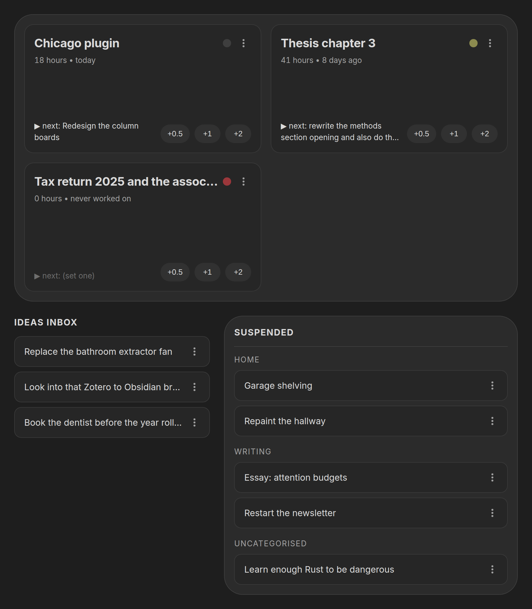
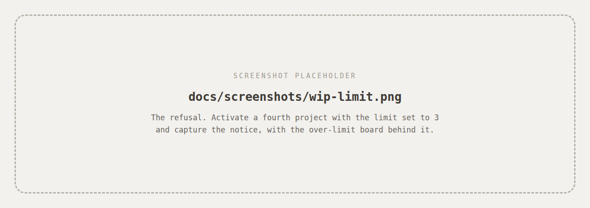
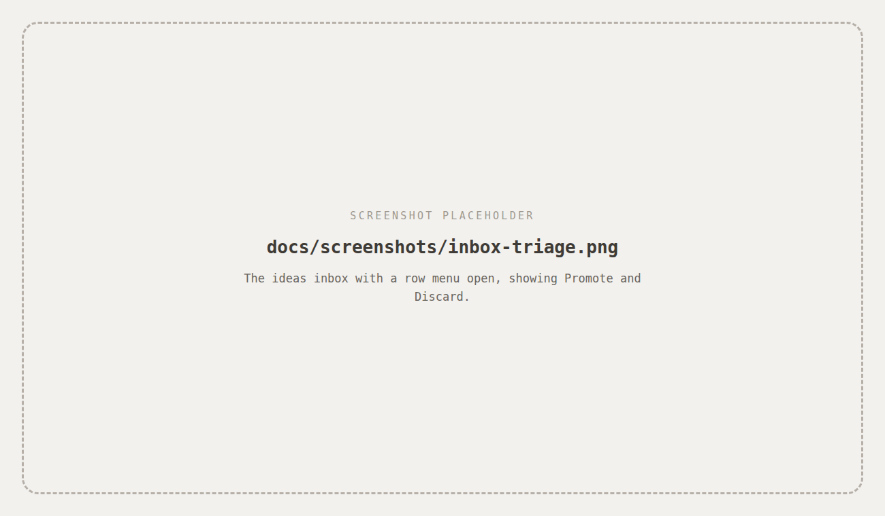

# Chicago

An opinionated Obsidian dashboard for people with project ideas but who
struggle with procrastination.

Chicago is one board with a **hard cap on how many projects can be active at
once**, and it will not let you past that cap.



## Why a limit you can't override

Chicago is built around three decisions:

**Ideas rot where you can't see them.** So the suspended list sits on the same
screen as your active work, always, with no click to reveal it.

**Too many options is the same as no options.** So the active limit is enforced
on the action, not drawn as a warning. Activate a fourth project with the limit
at three and it fails, with a notice naming what you'd have to park first. There
is no "allow anyway", because an override you can reach in one click is the same
as no limit at all.

**Bouncing off a project is a memory problem.** So every active project carries
a one-line **next action**: the smallest concrete thing you'd do next. If it's
empty the card says so, visibly, because an active project without one is the
one you're about to abandon.

Everything else is deliberately absent. No timers, no subtasks, no due dates, no
streaks, no charts. Logging work is one click on a preset button; a timer needs
you to remember to start *and* stop it, and one forgotten stop poisons the data
enough to kill the habit.

## What it does

- **Active tray** at the top of the board, capped at your WIP limit
- **One-click hour logging**: preset buttons, no dialog, no note prompt, with an
  undo on the notice for the inevitable misclick
- **Next action** per active project, edited inline on the card
- **Staleness dot** that turns amber then red as a project goes untouched, so
  "should I park this?" answers itself
- **Ideas inbox** that turns one-line jots in a note into projects, with an
  **Add new** button on the panel to jot one straight from the board, or several
  at once if you write several lines
- **Suspended list**, grouped by category, keeping full history; parking and
  re-activating preserves hours, next action, and last-touched exactly



## Your notes are the data

One Markdown note per project in `Projects/`. There is no database and no
plugin-owned index of your projects; the notes *are* the state, so you can
read, edit and grep them, and they keep working if this plugin ever stops being
maintained.

```yaml
---
status: someday        # "active" | "someday"
category: Games        # free-text grouping, optional
hours: 12.5            # cumulative, number
next: "wire up auth"   # one-line next action
touched: 2026-08-24    # date hours were last logged
created: 2024-07-29    # date the idea was captured
---
```

Chicago only ever writes frontmatter, through Obsidian's own
`processFrontMatter`, and **your note body is never rewritten, reformatted or
truncated**. Uninstall it and you're left with a folder of plain Markdown.

A note with no frontmatter at all still shows up, as suspended. Missing or
broken values fall back rather than erroring: no `hours` reads as 0, no
`touched` reads as "never worked on".

> The board labels the parked list **Suspended**, but the value stored on disk
> is `status: someday`. The stored contract is stable; the label is just a word.

## Using it

Open the board from the ribbon icon or the **Chicago: Open dashboard** command.
**Chicago: Capture idea** opens the same capture dialog as the panel's **Add
new** button, from wherever you happen to be. No hotkeys are registered; bind your own if you
want them.

Every action lives in the **⋮** menu on each row: Park, Activate, Delete on
projects; Promote and Discard on inbox lines. Dragging a card between the tray
and the suspended list does the same thing, but drag is only ever an
enhancement; nothing here is reachable *only* by dragging.

**Logging work.** Click `+0.5`, `+1` or `+2` on an active card. It adds to
`hours`, stamps `touched` with today's date, and re-renders that one card. The
increments are configurable.

**Setting a next action.** Click the next line on any active card and type. Enter
or clicking away commits, Escape cancels. One line only; anything longer
belongs in the note body.

**Triaging the inbox.** Paste one-line ideas into `Inbox.md` as `- like this`
whenever you capture them elsewhere. Promote turns a line into a project note
and removes exactly that line; Discard just removes it. The file is re-read
immediately before every write, so edits you made in another pane survive.



## Settings

| Setting | Default |
|---|---|
| Projects folder | `Projects` |
| Inbox note path | `Inbox.md` |
| Active WIP limit | `3` |
| Hour increment buttons | `0.5, 1, 2` |
| Staleness warning threshold (days) | `7` |
| Staleness stale threshold (days) | `21` |
| Open dashboard on startup | `false` |

A hand-edited or corrupted `data.json` won't crash the plugin; each field falls
back to its default on its own.

## Installing

Chicago is not in the community plugin directory yet. To install it by hand:

1. Download `main.js`, `manifest.json` and `styles.css` from the
   [latest release](https://github.com/desynkd/chicago/releases/latest)
2. Put all three in `<your vault>/.obsidian/plugins/chicago/`
3. Reload Obsidian and enable **Chicago** under Settings → Community plugins

## Building from source

Node 20 or newer. No runtime dependencies: everything it needs is the Obsidian
API and the DOM.

```bash
npm install
npm run build     # typecheck, then bundle to main.js
npm run dev       # watch build, symlinked straight into a vault
```

`npm run dev` writes into `$CHICAGO_VAULT_PATH/.obsidian/plugins/chicago/`. Set
that in your environment or in a gitignored `.env` at the repo root:

```
CHICAGO_VAULT_PATH=/path/to/your/vault
```

### Releasing

`npm version patch` (or `minor` / `major`) bumps `package.json`, writes the same
version into `manifest.json`, adds it to `versions.json` against the current
`minAppVersion`, and tags it. Obsidian requires a bare tag, so `.npmrc` strips
npm's `v` prefix.

```bash
npm version patch
git push --follow-tags
```

Pushing the tag runs [the release workflow](.github/workflows/release.yml),
which checks the tag against the manifest, builds, and publishes `main.js`,
`manifest.json` and `styles.css` as individual release assets; Obsidian's
tooling reads them individually and will not open a zip.

## Theming

Every colour in `styles.css` resolves to an Obsidian theme variable, so the
board wears whatever theme your vault does.

Surfaces are the one exception, and for a reason: `--background-secondary` sits
*below* `--background-primary` on dark themes, *above* it on light ones, and
some themes make the two identical, which flattened the whole board into a
single sheet. The board's three levels are instead mixed from `--text-normal`
into `--background-primary`, which always moves toward contrast whichever
direction that is. Each mix declares a plain-variable fallback for engines
without `color-mix`.

Layout responds to the width of the pane, not the window, so the board stacks
correctly when it's sharing the screen with a note.

## License

[MIT](LICENSE)

<sub>Chicago sounds like a random name, and it is, I guess. I named it after "Chicago" by Michael Jackson, which was playing on the background while I was trying to come up with one.</sub>
